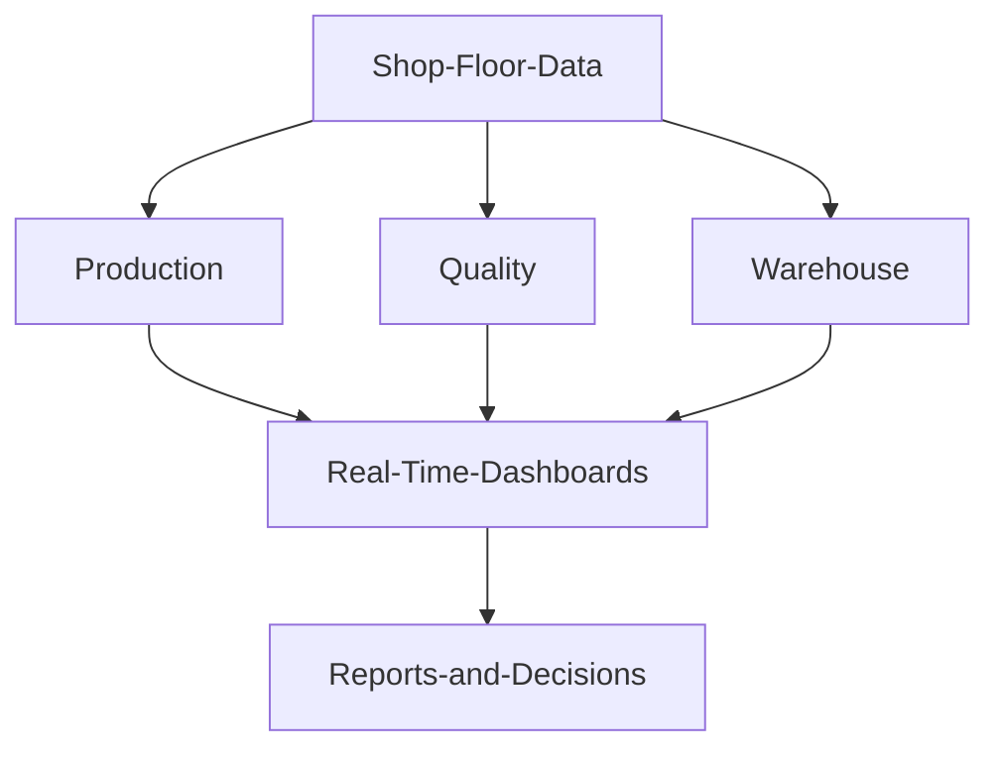

<!-- top-badges -->

    
    
    
    

<!-- header -->

<!-- ticker -->

<!-- contact icons -->

---

### 👨‍💻 About Me

I'm **MD. Ratul**, a Full-Stack Developer and ERP Software Engineer focused on building practical, scalable software for real-world business operations. I currently work as **Executive - ERP at HKD Outdoor Innovations Limited** (KEPZ, Chattogram), designing and developing enterprise applications for garment manufacturing.

- 🏭 Building Manufacturing ERP, Production & Quality dashboards, and FG Warehouse systems
- ⚡ Real-time applications with Socket.IO
- 🎓 B.Sc. in Computer Science & Engineering, Green University of Bangladesh (2020 – 2024)
- 🔬 Published researcher in deep learning (IEEE QPAIN 2025)

---

### 🛠️ Skills

| Property | Data |
|---|---|
| **Languages / Frameworks** |        |
| **Domain Knowledge** |       |
| **Databases** |      |
| **Libraries / Realtime** |      |
| **Tools / CI / CD** |      |

---

### 💼 Experience

**Executive - ERP** · HKD Outdoor Innovations Limited, KEPZ, Chattogram · *Nov 2025 – Present*
- Design and develop ERP applications for garment manufacturing operations
- Build Production, Quality, Maintenance, HR and Finished Goods Warehouse modules
- Create real-time production and quality dashboards
- Implement role-based access control and cross-department workflow automation

**Web Developer Intern** · Battery Low Interactive Ltd. · *Jul 2024 – Oct 2024*
- Built responsive web applications with React, JavaScript and CSS for real client projects

---

### ⭐ Featured Projects

| 🏭 FG Warehouse Management System | 🏗️ Manufacturing ERP System |
|---|---|
| Finished-goods warehouse system for garment factories: visual carton allocation, rack & row management, shipment management, barcode scanning & printing, CBM calculation, PO / Style / Buyer search, Excel data processing. | Integrated shop-floor ERP: Production, Quality, Maintenance and Industrial Engineering modules, real-time dashboards, line-wise monitoring, RFT / DHU reporting, machine management, role-based access. |
| `Next.js` `Express.js` `MongoDB` `Mongoose` `Cloudinary` `JWT` | `Next.js` `Express.js` `MongoDB` `Recharts` `JWT` |

---

### 🔬 Research

**Advancing Plant Disease Detection with Deep Learning** (2024): developed **PlantNet**, a custom MobileNet V1-based model reaching **94.08% accuracy**, compared against CNN, InceptionV3 and VGG16. Presented at **IEEE QPAIN 2025, BAUST, Bangladesh**. [📄 View Certificate](https://drive.google.com/file/d/1DRBpuBdorfKgqdAZyhxU0zJujx6OSJVL/view?usp=sharing)

---

### 📈 GitHub Activity Graph

| . | . |
|---|---|
|  |  |

---

### 🧭 How I Turn Business Processes Into Software

---

### 📫 How to Reach Me

#### Thanks for visiting :heart:

*If you liked my profile, feel free to star ⭐ my repositories. Want to collaborate? Submit a PR or issue, or email me and describe the agenda.*

